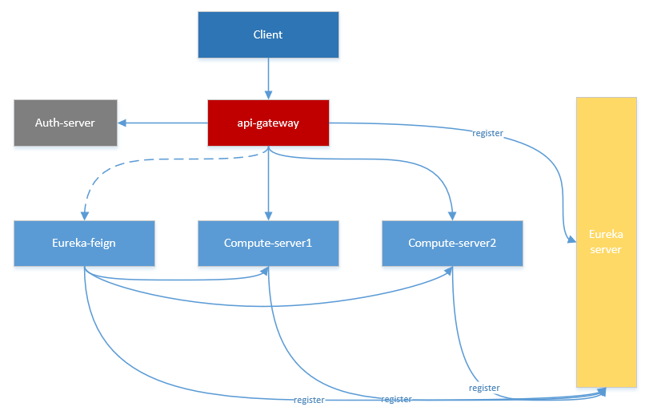
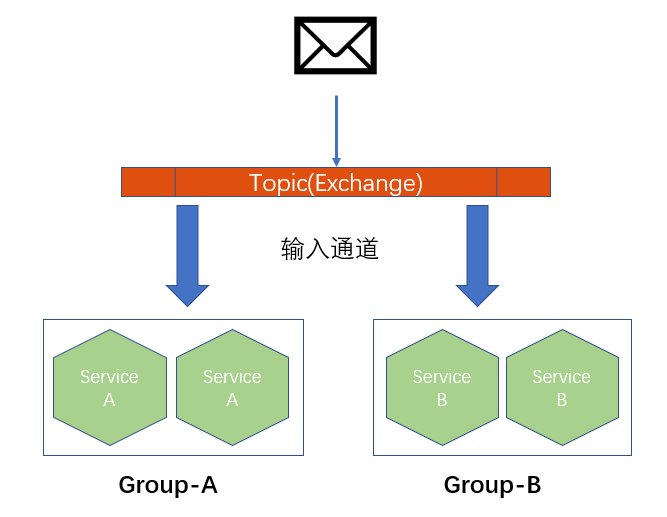

# Spring Cloud
## Spring Cloud 简介
Spring Cloud是一个基于Spring Boot实现的微服务架构开发工具。它为微服务架构中涉及的配置管理、服务治理、负载均衡、断路器、智能路由、微代理、控制总线、全局锁、决策竞选、分布式会话和集群状态管理等操作提供了一种简单的开发方式
## 主要的子项目
* Spring Cloud Config：配置管理工具，实现配置的外部化存储
* Spring Cloud Netflix：核心组件，对多个Netflix OSS开源套件进行整合
* Eureka：服务治理组件
* Hystrix：容错管理组件
* Ribbon：客户端负载均衡
* Feign：基于Ribbon和Hystrix的声明式服务调用组件
* Zuul：网关组件
* Spring Cloud Bus：事件、消息总线，用于传播集群中的状态变化或事件	
* Spring Cloud Consul：服务发现与配置管理工具
* Spring Cloud Stream：通过简单的声明式模型来发送和接收消息，整合了Rabbit和Kafka
* Spring Cloud Security：安全工具包
* Spring Cloud Sleuth：分布式跟踪
## 示例代码架构

## Spring Cloud Eureka - 服务治理
服务治理是微服务架构中最为核心和基础的模块，它主要用来实现各个微服务实例的自动化注册与发现

## Spring Cloud Ribbon - 负载均衡

负载均衡设备按照某种算法（线性轮询、按权重负载、按流量负载等）从维护的可用服务端清单中取出一台服务端的地址，然后进行转发
## Spring Cloud Ribbon - 负载均衡策略
### 按权重负载
假设有4个实例A、B、C、D，他们的平均响应时间为10、40、80、100，所以总响应时间是10+40+80+100=230，每个实例的权重为总响应时间与实例自身的平均响应时间的差的积累所得，所以实例A、B、C、D的权重分别如下所示：   
* 实例A：230-10=220         --> [0,220]    
* 实例B：220+(230-40)=410   --> (220,410]   
* 实例C：410+(230-80)=560   --> (410,560]   
* 实例D：560+(230-100)=690  --> (560,690]

实例的平均响应时间越短，权重区间越大，被选中的几率就越高
## Spring Cloud Hystrix – 断路器
在分布式架构中，当某个服务单元发生故障之后，通过断路器的故障监控，向调用方返回一个错误响应，而不是长时间的等待。这样就不会使得线程因调用故障服务被长时间占用不释放，避免了故障在分布式系统中的蔓延
## Spring Cloud Feign – 声明式服务调用 
Spring Cloud Feign整合了Ribbon和Hystrix的功能，还提供了一种声明式的Web服务客户端定义方式
## Spring Cloud Zuul – API网关服务
API网关是一个更为智能的应用服务器，它的定义类似于面向对象设计模式中的Façade模式，它的存在就像是整个微服务架构系统的门面一样，所有的外部客户端访问都需要经过它来进行调度和过滤。   
### 主要实现的功能
* 请求路由
* 负载均衡
* 校验过滤
## Spring Cloud Stream – 消息驱动的微服务
Spring Cloud Stream 是一个用来为微服务应用构建消息驱动能力的框架,大幅简化了开发人员对消息中间件的使用复杂度
### 核心概念
应用程序与消息中间件是通过绑定器Binder相关联的，有了绑定器我们更换消息中间件产品时只需要更换对应的Binder而不需要修改任何应用逻辑   

### 消息组
    
## Spring Cloud Config - 分布式配置中心
Spring Cloud Config 是一个用来为分布式系统中的基础设施和微服务应用提供集中化的外部配置支持
# HDFS
* [官网地址](http://hadoop.apache.org/docs/current/index.html)
* [Hadoop多节点集群安装配置](http://blog.csdn.net/u011692203/article/details/46898293)
* [HDFS的运行原理](http://www.cnblogs.com/laov/p/3434917.html)
## 伪分布式模式的简单配置步骤
1. [下载hadoop](http://apache.communilink.net/hadoop/common/)
```sh
wget http://apache.communilink.net/hadoop/common/hadoop-2.8.1/hadoop-2.8.1.tar.gz
```
2. 打开etc/hadoop/hadoop-env.sh，配置java安装的根目录
```sh
export JAVA_HOME=/usr/java/latest
``` 
3. 打开etc/hadoop/core-site.xml，配置namenode的地址和端口
```xml
<configuration>
    <property>
        <name>fs.defaultFS</name>
        <value>hdfs://localhost:9000</value>
    </property>
</configuration>
```
4. 打开etc/hadoop/hdfs-site.xml，配置数据副本数量
```xml
<configuration>
    <property>
        <name>dfs.replication</name>
        <value>1</value>
    </property>
</configuration>
```
5. 配置ssh免密登录（在Hadoop启动以后，NameNode是通过SSH（Secure Shell）来启动和停止各个DataNode上的各种守护进程的）
```sh
$ ssh-keygen -t rsa -P '' -f ~/.ssh/id_rsa
$ cat ~/.ssh/id_rsa.pub >> ~/.ssh/authorized_keys
$ chmod 0600 ~/.ssh/authorized_keys
```
6. 格式化文件系统
```sh
$ bin/hdfs namenode -format
```
7. 启动NameNode和DataNode
```sh
$ sbin/start-dfs.sh
```
# Oauth2.0
## Token Auth
Json web token (JWT), 是为了在网络应用环境间传递声明而执行的一种基于JSON的开放标准（RFC 7519).该token被设计为紧凑且安全的，特别适用于分布式站点的单点登录（SSO）场景。JWT的声明一般被用来在身份提供者和服务提供者间传递被认证的用户身份信息，以便于从资源服务器获取资源，也可以增加一些额外的其它业务逻辑所必须的声明信息，该token也可直接被用于认证，也可被加密.
## JWT的构成
https://jwt.io/introduction/
## Cookie与Token验证方式的对比

## Token机制的优势
* 支持跨域访问: Cookie是不允许垮域访问的，这一点对Token机制是不存在的，前提是传输的用户认证信息通过HTTP头传输.
* 无状态(也称：服务端可扩展行):Token机制在服务端不需要存储session信息，因为Token 自身包含了所有登录用户的信息，只需要在客户端的cookie或本地介质存储状态信息.
* 更适用CDN: 可以通过内容分发网络请求你服务端的所有资料（如：javascript，HTML,图片等），而你的服务端只要提供API即可.
* 去耦: 不需要绑定到一个特定的身份验证方案。Token可以在任何地方生成，只要在你的API被调用的时候，你可以进行Token生成调用即可.
更适用于移动应用: 当你的客户端是一个原生平台（iOS, Android，Windows 8等）时，Cookie是不被支持的（你需要通过Cookie容器进行处理），这时采用Token认证机制就会简单得多。
* CSRF:因为不再依赖于Cookie，所以你就不需要考虑对CSRF（跨站请求伪造）的防范。
* 性能: 一次网络往返时间（通过数据库查询session信息）总比做一次HMACSHA256计算 的Token验证和解析要费时得多.
* 不需要为登录页面做特殊处理: 如果你使用Protractor 做功能测试的时候，不再需要为登录页面做特殊处理.
* 基于标准化:你的API可以采用标准化的 JSON Web Token (JWT). 这个标准已经存在多个后端库（.NET, Ruby, Java,Python, PHP）和多家公司的支持（如：Firebase,Google, Microsoft）
## OAuth Roles
* Resource Owner
* Client
* Resource Server
* Authorization Server
## 角色之间的关系

1. 用户打开客户端以后，客户端要求用户给予授权。
2. 用户同意给予客户端授权。
3. 客户端使用上一步获得的授权，向认证服务器申请令牌。
4. 认证服务器对客户端进行认证以后，确认无误，同意发放令牌。
5. 客户端使用令牌，向资源服务器申请获取资源。
6. 资源服务器确认令牌无误，同意向客户端开放资源
## Authorization Grant
* Authorization Code - 授权码模式
* Implicit - 简化模式
* Resource Owner Password Credentials - 密码模式
* Client Credentials - 客户端模式
## 授权码模式认证流程

## 基于Zuul的认证流程

# 参考文献
* https://www.digitalocean.com/community/tutorials/an-introduction-to-oauth-2   
* https://spring.io/guides/tutorials/spring-boot-oauth2/
* http://www.ruanyifeng.com/blog/2014/05/oauth_2_0.html  
* http://blog.csdn.net/xiejx618/article/details/51039653   
* https://jwt.io/introduction/
* http://www.cnblogs.com/xiekeli/p/5607107.html
* https://martinfowler.com/articles/microservices.html
* http://blog.csdn.net/u011692203/article/details/46898293
* http://hadoop.apache.org/docs/current/index.html
* [《Spring Cloud 微服务实战》](http://download.csdn.net/download/yonghu99999/9854548)


